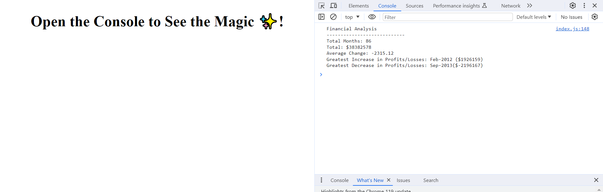

# Console-Finances

## Description
The aim of this project is creating code for analyzing the financial records of a company using **JavaScript**. 

By maintaining this deployed webpage, I aim to present a comprehensive overview of my work and make it easy for others to connect with me.

## Installation
N/A

## Usage
A dataset is composed of **arrays** with two fields: Date and Profit/Losses.

Using **JavaScript** I analyze the records to calculate each of the following:

- the total number of months included in the dataset.
- the net total amount of Profit/Losses over the entire period.
- the average of the changes in Profit/Losses over the entire period.
- the greatest increase in profits (date and difference in the amounts) over the entire period.
- the greatest decrease in losses (date and difference in the amounts) over the entire period.

**The code prints the analysis to the console.**

After opening the code in the browser the resulting analysis looks as following:

The [URL](https://paulinasiwko.github.io/Console-Finances/) of deployed application.

## Credits
N/A

## Licence 
N/A
